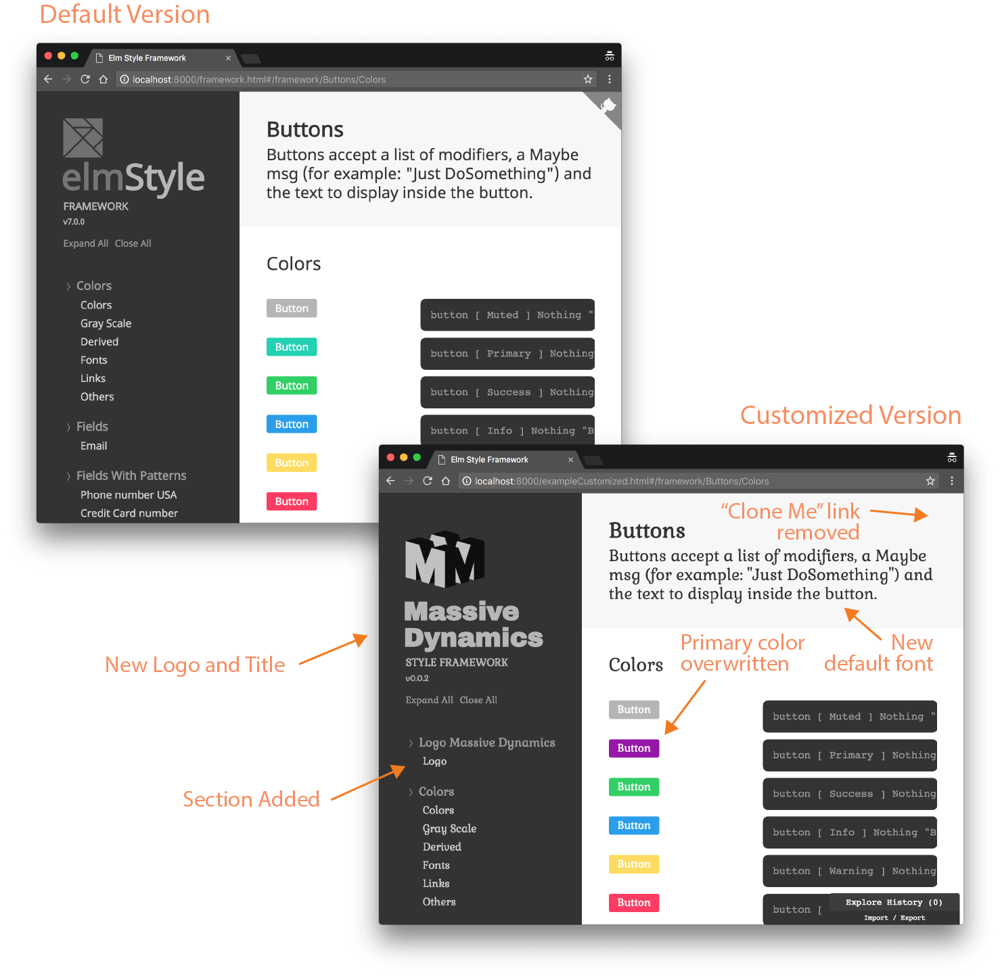

# Elm Style Framework

[Demo](https://lucamug.github.io/elm-style-framework/)

## An experimental Style Framework built on top of style-elements.

This is an incomplete Style Framework that leverage the [experimental version of style-elements](http://package.elm-lang.org/packages/mdgriffith/stylish-elephants/4.0.0). Major changes may happen at any time to this Repo.

The framework has a built-in style guide generator and allow customization on several levels.

<a href="https://lucamug.github.io/elm-style-framework/">
  
</a>

To use it:

```elm
module Main exposing (main)

import Element exposing (layout)
import Framework.Button as Button
import Framework.Modifier exposing (Modifier(..))
import Html


main : Html.Html a
main =
    layout [] <|
        Button.button [ Medium, Success, Outlined ] Nothing "Button"
```
